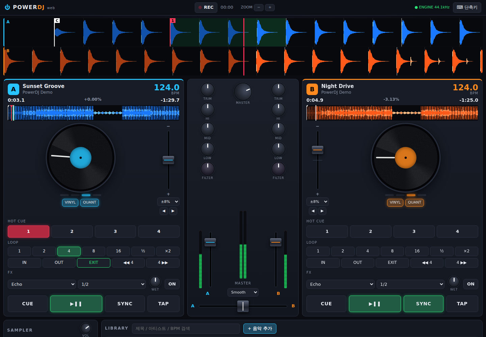

# PowerDJ Web

브라우저에서 바로 실행되는 2덱 DJ 프로그램입니다. 설치나 빌드 없이 `index.html`만 열면 됩니다 (Web Audio API 사용).



## 실행

```bash
# 파일을 바로 열어도 되고
open index.html
# 로컬 서버로 띄워도 됩니다
python3 -m http.server 8000   # → http://localhost:8000
```

처음 실행하면 믹스 연습용 **데모 트랙 2곡**(124 / 128 BPM)이 합성되어 A/B 덱에 자동으로 로드됩니다.
브라우저 정책상 소리는 화면을 한 번 클릭해야 나옵니다.

## 기능

| 영역 | 기능 |
| --- | --- |
| **덱 (A/B)** | 재생/일시정지, CDJ식 CUE (누르고 있으면 미리듣기), 핫큐 4개, 회전하는 플래터 |
| **플래터** | VINYL 모드: 드래그로 스크래치(역재생 포함) / 끄면 피치 벤드 |
| **템포** | 피치 페이더 (±8 / ±16 / ±50%), 피치 벤드, TAP 템포, SYNC (템포 + 비트 위상 맞춤, 잠금 유지) |
| **분석** | 자동 BPM 검출 + 비트그리드, 저역/전체 대역 컬러 파형 |
| **루프** | 오토 루프 1–16비트, IN/OUT 수동 루프, ½ / ×2, EXIT, 4비트 점프, 퀀타이즈 |
| **FX** | Echo / Reverb / Flanger (BPM 동기화, WET 조절) |
| **믹서** | 채널별 TRIM, 3밴드 EQ (킬 지원), 필터 (LPF↔HPF), 채널 페이더, VU 미터 |
| **마스터** | 크로스페이더 (Smooth / Dipless / Cut 커브), 마스터 볼륨, 리미터, 스테레오 VU |
| **파형** | 스크롤 줌 파형(비트그리드, 큐·루프 표시, 드래그 탐색), 전체 오버뷰(클릭 탐색) |
| **샘플러** | 에어혼, 사이렌, 레이저, 베이스 드롭 |
| **라이브러리** | 파일 추가/드래그&드롭, 검색, 정렬, 덱으로 드래그해서 로드, 더블클릭 로드 |
| **녹음** | 마스터 출력을 녹음해 `.webm` 파일로 저장 |

파일 이름이 `아티스트 - 제목.mp3` 형식이면 아티스트/제목을 자동으로 나눕니다.

## 키보드 단축키

| DECK A | DECK B | 동작 |
| --- | --- | --- |
| `Q` | `P` | 재생 / 일시정지 |
| `W` | `O` | CUE |
| `E` | `I` | SYNC |
| `1`–`4` | `7`–`0` | 핫큐 (Shift = 삭제) |
| `A` | `L` | 4비트 루프 |
| `Z` / `X` | `N` / `M` | 피치 벤드 − / + |

`←` `→` 크로스페이더, `↓` 크로스페이더 센터, `G` `H` `J` `K` 샘플러

## 구조

```
index.html        레이아웃 + 덱 템플릿
css/style.css     스타일 (반응형)
js/analysis.js    파형/BPM 분석, 데모 트랙 합성기
js/deck.js        Deck 클래스 — 재생, 루프, 큐, EQ/필터/FX 오디오 그래프
js/ui.js          노브·페이더 컴포넌트, 공용 유틸
js/app.js         마스터 버스, 믹서, 파형 렌더링, 라이브러리, 샘플러, 녹음, 단축키
```

## 한계

- 템포를 바꾸면 음정도 함께 바뀝니다 (키락/마스터 템포 미지원).
- 헤드폰 프리뷰(CUE 출력 분리)는 지원하지 않습니다.
- 라이브러리는 세션 동안만 유지됩니다 (새로고침 시 초기화).
